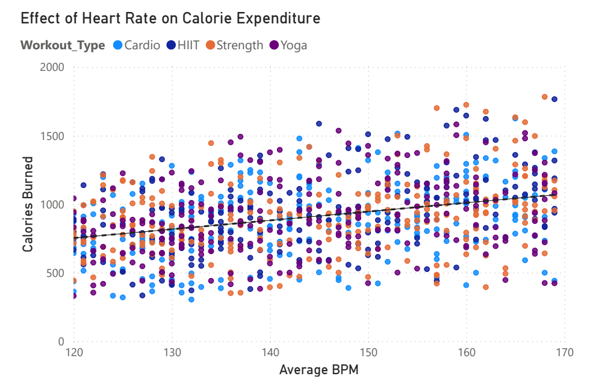
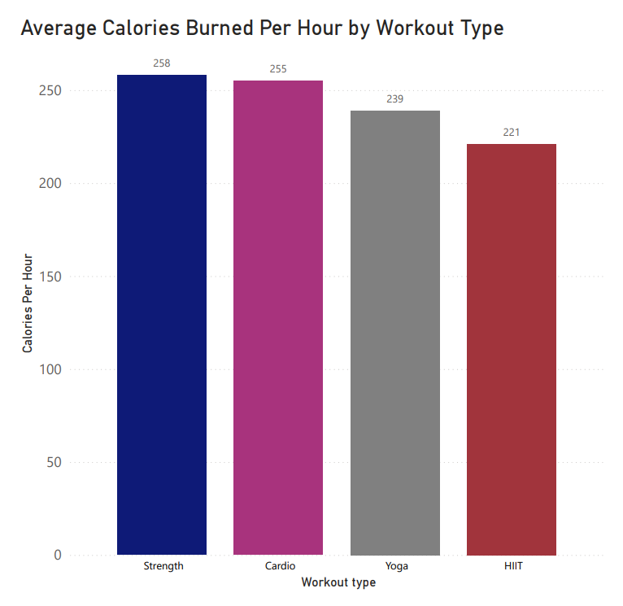
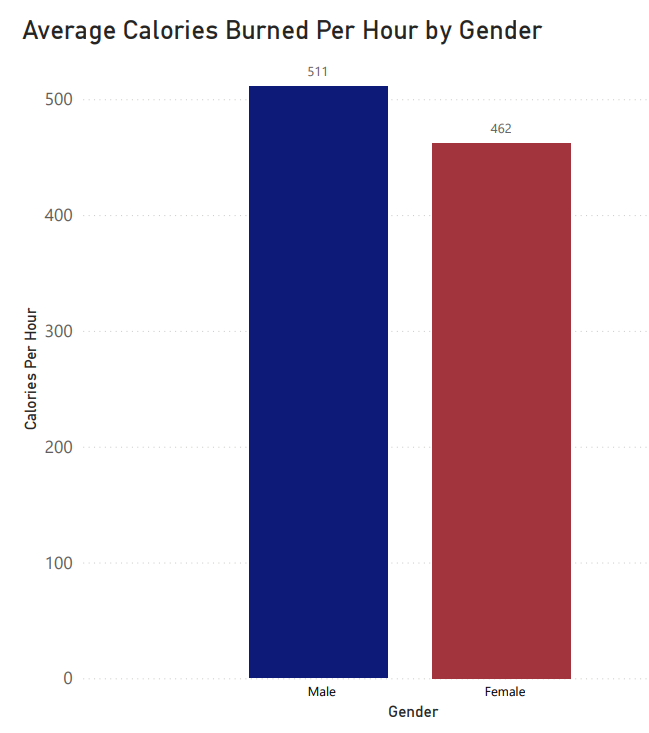
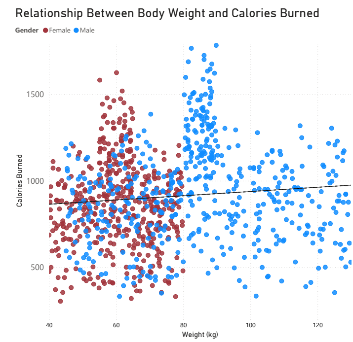
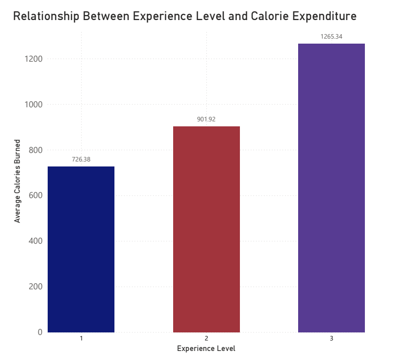

# Fitness Calorie Expenditure Analysis

## Project Overview

This project was completed as part of my Data Analytics studies at Noroff.

The objective was to investigate which factors have the greatest impact on calorie expenditure during exercise using Exploratory Data Analysis (EDA) and Power BI.

The project simulates a real-world fitness dataset to explore how workout characteristics and individual factors influence calorie expenditure.

---

# Project Objectives

The objectives of this project were to:

- Research the relationship between workout duration and total calorie expenditure.
- Examine the impact of average heart rate on calorie expenditure.
- Compare different workout types and their efficiency in calorie expenditure.
- Investigate how individual characteristics such as gender, body weight and experience level influence workout outcomes.

---

# Dataset

- **Source:** Kaggle
- **Observations:** 972 workout sessions
- **Format:** CSV
- **Data Type:** Simulated workout data

The dataset was created to simulate realistic fitness tracking data and contains no real personal information.

---

# Exploratory Data Analysis

## 1. Relationship Between Workout Duration and Calorie Expenditure

Workout duration demonstrated the strongest positive relationship with calorie expenditure. Longer workout sessions consistently resulted in higher calorie burn.

![Workout Duration] (Images/Relationship Between Workout Duration and Calorie Expenditure.png)

---

## 2. Effect of Heart Rate on Calorie Expenditure

Average heart rate showed a positive relationship with calorie expenditure, although considerably weaker than workout duration.

---

## 3. Average Calories Burned Per Hour by Workout Type

To compare workout efficiency fairly, a new variable called **Calories_Per_Hour** was created.

Strength training and cardio demonstrated the highest calorie expenditure per hour.

---

## 4. Average Calories Burned Per Hour by Gender

Male participants demonstrated a higher average calorie expenditure per hour than female participants within this dataset.

---

## 5. Relationship Between Body Weight and Calories Burned

Body weight showed a weak positive relationship with calorie expenditure. Considerable variation suggested that body weight alone is not a strong predictor.

---

## 6. Relationship Between Experience Level and Calorie Expenditure

Participants with higher experience levels generally demonstrated greater calorie expenditure during workout sessions.

---

# Feature Engineering

To improve the analysis, a new variable called **Calories_Per_Hour** was created.

Since workout sessions had different durations, comparing total calories burned alone would not provide a fair comparison between participants.

This new variable standardized calorie expenditure by workout duration, making it possible to compare workout efficiency across different exercise types.

---

# Tools Used

- Power BI
- Exploratory Data Analysis (EDA)
- Data Cleaning
- Feature Engineering
- Data Visualization

---

# Key Findings

- Workout duration was the strongest predictor of calorie expenditure.
- Heart rate showed a positive but weaker relationship with calorie burn.
- Strength training produced the highest average calorie expenditure per hour.
- Male participants burned more calories per hour than female participants.
- Experience level showed a strong association with calorie expenditure.
- HIIT demonstrated lower calorie expenditure per hour than expected.

---

# What I Learned

Through this project I gained practical experience with:

- Exploratory Data Analysis
- Data storytelling
- Feature engineering
- Power BI
- Data visualization
- Translating data into actionable insights

---

# Full Report

The complete project report can be found in:

**Report → Exam Project Noroff Trond Einar Myrvold.pdf**

---

# Disclaimer

This project was completed as part of my studies at Noroff.

The dataset consists entirely of simulated fitness data obtained from Kaggle and contains no real personal information.
